# Continuous Control using DRL - Training Multiple AI Agents within Unity framework 

## 01. Introduction

This project demonstrates the use of Deep Reinforcement Learning for training AI agents to perform continuous controls. I work with a couple of Unity ML-Agents environment to teach single-agent and multiple-agents in both independent and competitive settings. Deep Deterministic Policy Gradient (DDPG) policy optimization technique is used for all the tasks.

## 02. Environments

---

### a. [Tennis](https://github.com/Unity-Technologies/ml-agents/blob/master/docs/Learning-Environment-Examples.md#tennis) environment for training two agents to play against each other in a competitive manner.

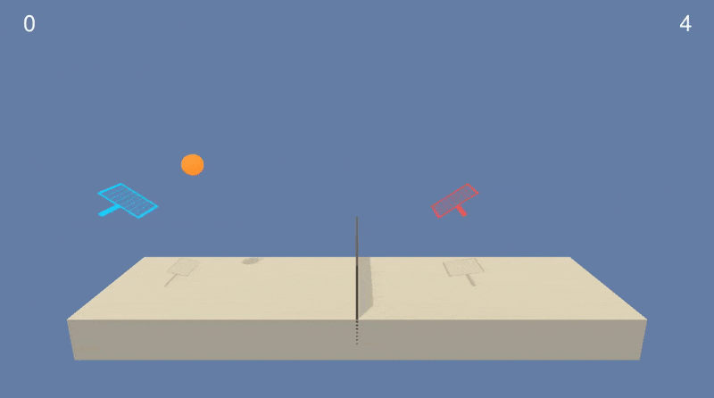  
*Figure - Untrained Tennis Agents* 

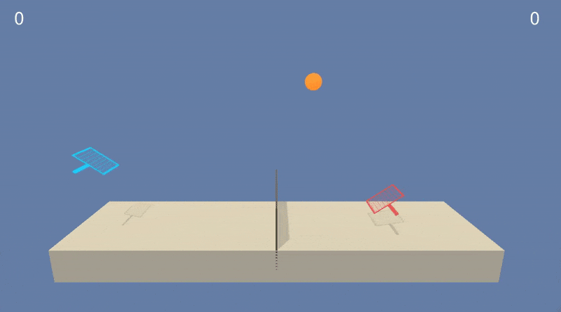  
*Figure - Testing the Agents after training the agents for 1800 episodes*

In this environment, two agents control rackets to bounce a ball over a net. If an agent hits the ball over the net, it receives a reward of +0.1. If an agent lets a ball hit the ground or hits the ball out of bounds, it receives a reward of -0.01. Thus, the goal of each agent is to keep the ball in play.

The observation space consists of 8 variables corresponding to the position and velocity of the ball and racket. Each agent receives its own, local observation. Two continuous actions are available, corresponding to movement toward (or away from) the net, and jumping.

#### Solving the Environment

The task is episodic, and in order to solve the environment, the agents must get an average score of +0.5 (over 100 consecutive episodes, after taking the maximum over both agents). Specifically, After each episode, the rewards that each agent received (without discounting) is added up, to get a score for each agent. This yields 2 (potentially different) scores. The average of these two scores is then considered as the final score for each episode.

#### Training the Agent[s]    

The agent achieved an average score of **0.62** after **1803** episodes. The average score was computed over 100 consecutive episodes. Model weights are saved to file for the episode which achieves the best score so far. This model is later used for testing and it achieves an average score of **1.05** over 100 consecutive episodes. 

| Training                         |  Testing                                |
|:--------------------------------:|:---------------------------------------:|
|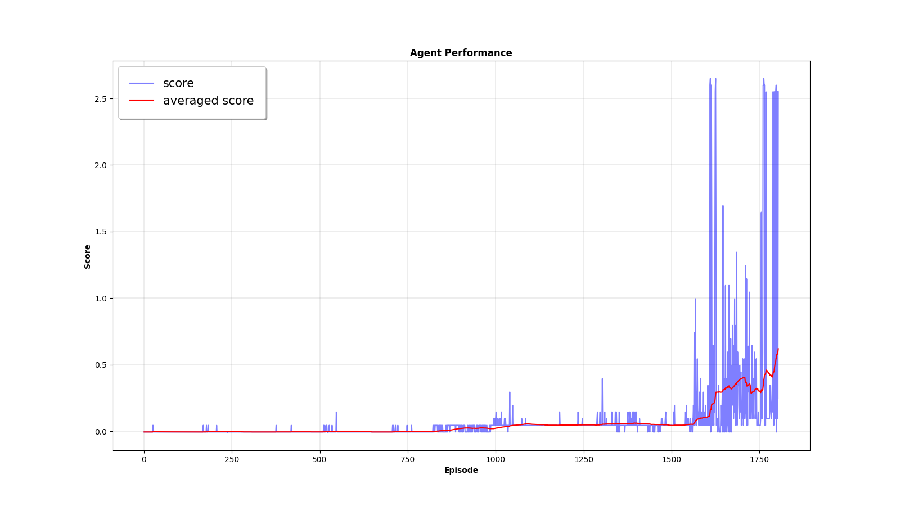         |   | 

---

### b. [Reacher](https://github.com/Unity-Technologies/ml-agents/blob/master/docs/Learning-Environment-Examples.md#reacher) environment for training Single and Multiple agents.

| Single Agent                         |  Multiple Agents                      |
|:------------------------------------:|:-------------------------------------:|
|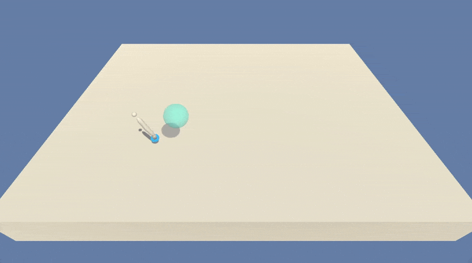  |    |  
| *Figure - Single Untrained Agent* | *Figure - Multiple Untrained Agents* |
|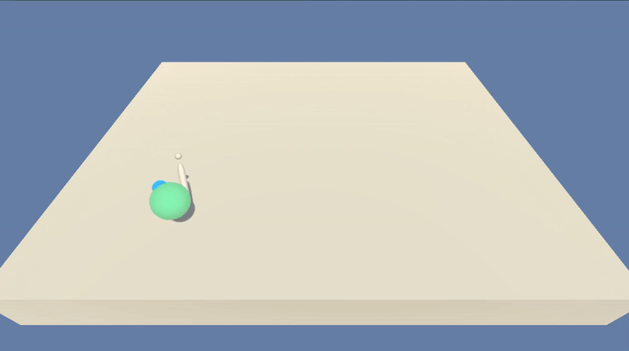  |    |  
| *Figure - Testing on Single Agent after training a single agent for 1200 episodes* | *Figure - Testing on Multiple Agents after training a single agent for 1200 episodes* |
|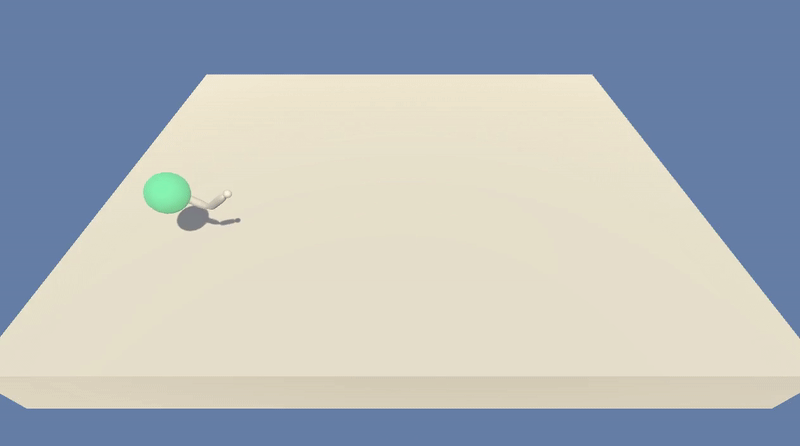  | 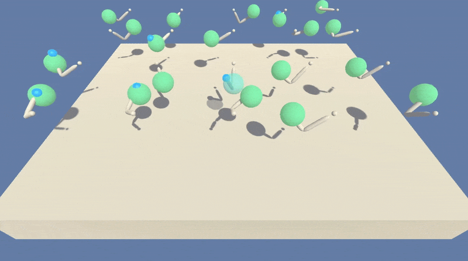   |  
| *Figure - Testing on Single Agent after training multiple agents for 50 episodes* | *Figure - Testing on Multiple Agents after training multiple agents for 50 episodes* |

In this environment, a double-jointed arm can move to target locations. A reward of +0.1 is provided for each step that the agent's hand is in the goal location. Thus, the goal of the agent is to maintain its position at the target location for as many time steps as possible.

The observation space consists of 33 variables corresponding to position, rotation, velocity, and angular velocities of the arm. Each action is a vector with four numbers, corresponding to torque applicable to two joints. Every entry in the action vector should be a number between -1 and 1.

#### Flavors of Environment

Two separate versions of the Unity environment is used:  
- The first version contains a single agent.
- The second version contains 20 identical agents, each with its own copy of the environment.  

#### Solving the Environment

##### First Version / Training with Single Agent

The task is episodic, and in order to solve the environment, the agent must get an average score of +30 over 100 consecutive episodes.

##### Second Version / Training with Multiple Agents

The barrier for solving the second version of the environment is slightly different, to take into account the presence of many agents. In particular, the agents must get an average score of +30 (over 100 consecutive episodes, and over all agents). Specifically,  
- After each episode, the rewards that each agent received (without discounting) is added up, to get a score for each agent. This yields 20 (potentially different) scores. Then, the average of these 20 scores are taken.  
- This yields an **average score** for each episode (where the average is over all 20 agents).  

The environment is considered solved, when the average (over 100 episodes) of those average scores is at least +30. 

#### Training the Agent[s]  

##### Single Agent  

The agent achieved an average score of **33.4** after **1120** episodes and then the performance started degrading as shown in the plot below. Model weights are saved to file for the episode which achieves the best score so far. This model is later used for testing and it achieves an average score of **32.5** over 100 consecutive episodes. 

| Training                         |  Testing                                |
|:--------------------------------:|:---------------------------------------:|
|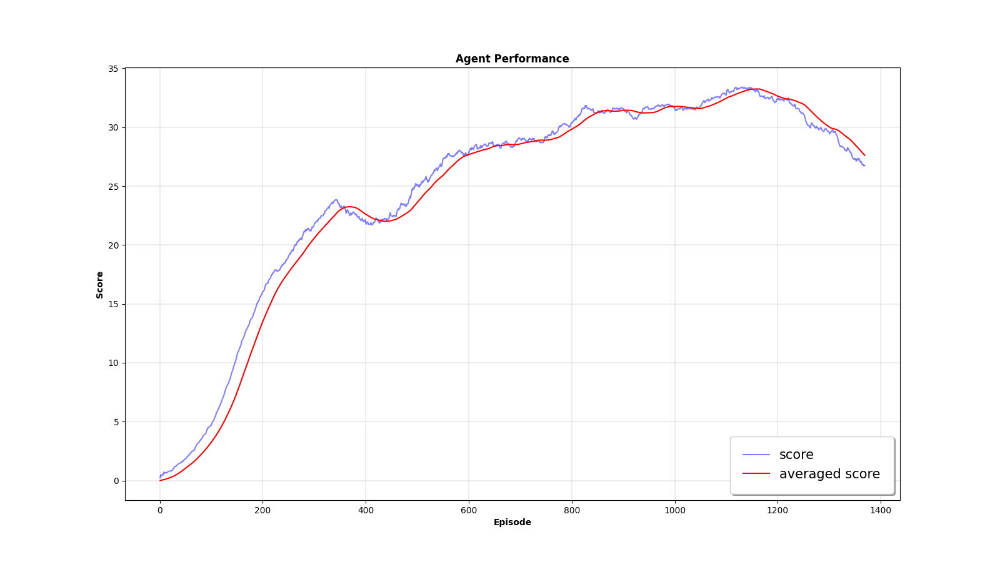   | 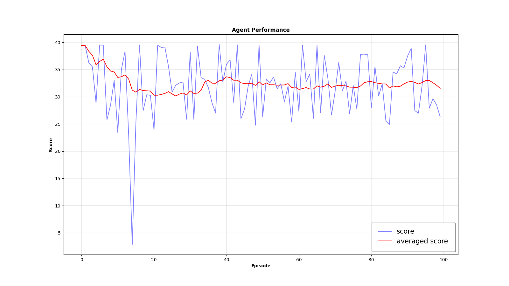  | 

This model was used to test the agents within multi-agent environment, and it achieves similar performance.  

##### Multiple Agents  

To train agents within multi-agent environment, 
 - A single DDPG actor-critic model was instantiated.  
 - Multiple agents were used to collect experiences in parallel.  
 - Single model was used to predict actions.  
 - Tuple (s, a, r, s') from each agent is used to learn a better policy and update the model.   

This model is able to learn much faster and is highly stable. During training, it achieves an average score (over all the agents) of **34** in just **50 episodes**. Testing this model on single agent environment gives an average score of **37.0** over 100 consecutive episodes.

| Training                         |  Testing                                |
|:--------------------------------:|:---------------------------------------:|
|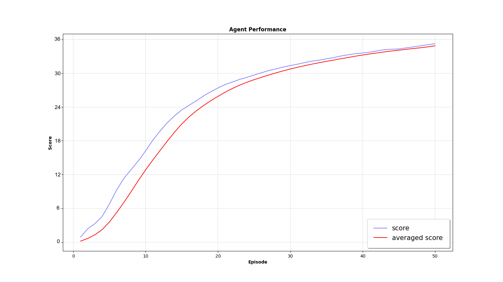   | 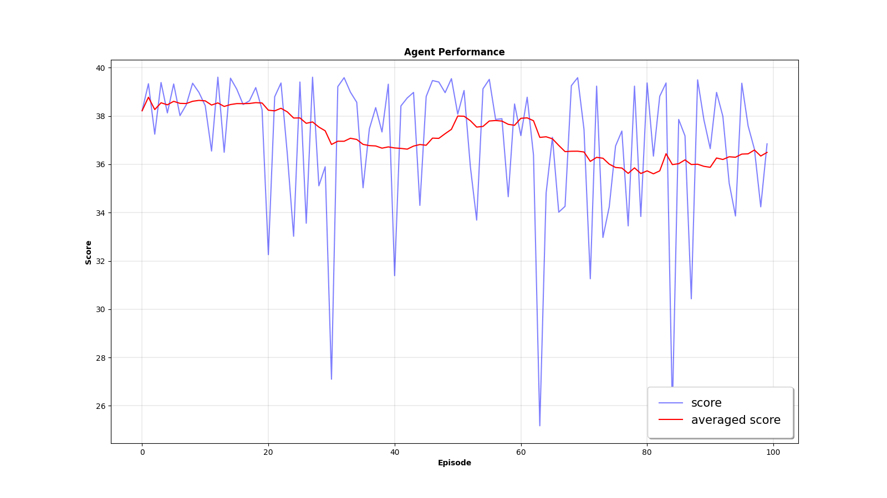  | 

---

## 03. Algorithm  

[Deep Deterministic Policy Gradient (DDPG)](https://arxiv.org/abs/1509.02971), which is an actor-critic, model-free algorithm based on the deterministic poolicy gradient that can operate over continuous action spaces are used for solving this problem. Following changes were made to this algorithmto stabilize the training and utilize collected experiences:  

 - Instead of updating the target actor and critic networks every step, I update them every **DELTA_STEPS** steps. I selected ```DELTA_STEPS = 20```.  
 - Instead of learning just once by sampling from the **Replay Buffer**, the agent samples **NUM_UPDATES** mini-batches and learns from it. I selected ```NUM_UPDATES = 10```.  
 - So, the agents go into the learning phase every **DELTA_STEPS** steps, and learns **NUM_UPDATES** times from the minibatches sampled from **Replay Buffer**.  
 - Used parameters **EPSILON** and **EPSILON_DECAY** for decaying the amount of noise (Ornstein-Uhlenbeck Pprocess) added to the **actions** over time as shown below.   
  ```
  # update epsilon
  self.epsilon = self.epsilon * (1.0 - EPSILON_DECAY)
  # add noise to the action
  action += self.epsilon * self.noise.sample()
  ```   
 - Noise model is reset every few steps, ```reset_noise_t = 100```, to promote exploration.  

Hyper parameters used for DDPG are shown below:  

```
BUFFER_SIZE = int(1e6)  # replay buffer size
BATCH_SIZE = 512        # minibatch size
GAMMA = 0.99            # discount factor
TAU = 1e-3              # for soft update of target parameters
LR_ACTOR = 1e-4         # learning rate of the actor 
LR_CRITIC = 1e-3        # learning rate of the critic
WEIGHT_DECAY = 0        # L2 weight decay
DELTA_STEPS = 20        # Update every DELTA_STEPS steps
NUM_UPDATES = 10        # num of update passes when updating
EPSILON = 1.0           # epsilon for the noise process added to the actions
EPSILON_DECAY = 1e-6    # decay for epsilon above
```

## 04. Running the Code  

```
usage: main.py [-h] [--env ENV] [--explore] [--train] [--test]
               [--n_episodes N_EPISODES]

optional arguments:
  -h, --help            show this help message and exit
  --env ENV             environment to be used
  --explore             explore the environment
  --train               train the DDPG agent
  --test                test the DDPG agent
  --n_episodes N_EPISODES
                        number of episodes
```

Options for ```ENV``` are:  

```
reacher_single
reacher_multi
crawler
tennis
```

#### Explore  

 - Explore the environment:  

    ```
    python main.py --env=[reacher_single | reacher_multi | crawler | tennis] --explore --n_episodes=100
    ```

#### Training  

 - Train the agents:  

    ```
    python main.py --env=[reacher_single | reacher_multi | crawler | tennis] --train --n_episodes=2000
    ```

#### Testing 

 - Test the agents:  

    ```
    python main.py --env=[reacher_single | reacher_multi | crawler | tennis] --test --n_episodes=100
    ```

---

## 05. Future Work

As evident by the [Benchmarking Deep Reinforcement Learning for Continuous Control](https://arxiv.org/abs/1604.06778) paper, [Trust Region Policy Optimization (TRPO)](https://arxiv.org/abs/1502.05477) could be a better choice for policy optimization. TRPO will be used in future for benchmarking against DDPG on these environments.